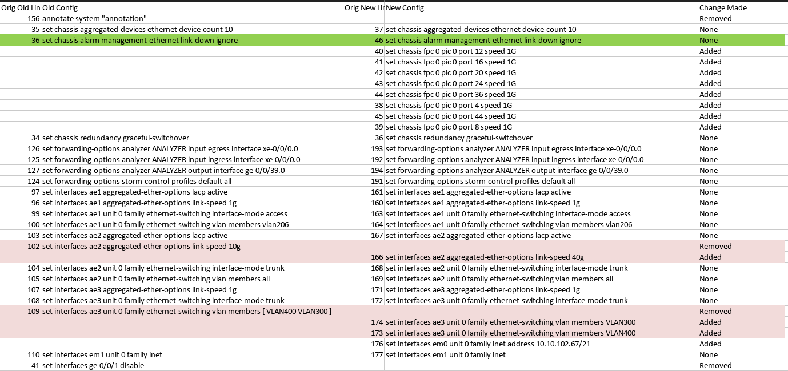

# Config Diff: A Proposed Way To Visualise Juniper Set File Differences

### Why

During a tech refresh involving a migration from a very old Juniper device to a brand-new one, I ran into an interesting problem: traditional diff tools (like Git or Notepad++) were not really great at highlighting differences for flat configuration files.

Because Juniper set commands can be positioned on different lines in a flat-file but still result in the exact same configuration, standard tools marked everything as "different".

I needed a way to verify that the configurations were contextually the same, even if the line numbers did not match.

### What I Did

I created a script that does something really basic: sort and compare by alphabetical order.

Here are a few notable parts of this solution:
- Using `itemgetter()` to keep track of the original line numbers from the raw config files. This way, even though the script is sorting them to compare, it can still reference the original position of that line in the file.
- Generating a `CSV` file makes it easy to share with clients or colleagues who can just open it Excel and quickly understand what has been changed.



### Takeaways
While I "vibe-coded" some of the logic, this is a functional tool that helped me avoid manually "touching the config file" and ensured everything stayed accurate when preparing for the migration.

However, when it comes to versioning multiple configuration iterations, across many devices, I would go for tried and true systems like Git.  
Perhaps, this script can be integrated with git commands to do contextual comparisons between different commits.

### Script

```py
import csv
import argparse
import difflib
from operator import itemgetter

def compare_configs(old_path, new_path, output_path):
    
    # 1 --- Enumerate the lines of the configuration file. This provides the tuple: (original line number, command)
    # 2 --- If there is a blank line, go the the next line
    # 3 --- After getting the list of tuples, use itemgetter() to consider the the command only and sort alphabetically
    # 4 --- Now we have a list of tuples sorted according to alphabetical order

    with open(old_path, 'r', encoding='utf-8') as f:
        old_data = sorted([(i + 1, line.strip()) for i, line in enumerate(f) if line.strip()], key=itemgetter(1)) 

    with open(new_path, 'r', encoding='utf-8') as f:
        new_data = sorted([(i + 1, line.strip()) for i, line in enumerate(f) if line.strip()], key=itemgetter(1))

    # Extract just the text for the diff engine
    old_text_only = [item[1] for item in old_data]
    new_text_only = [item[1] for item in new_data]

    # Generate the delta
    d = difflib.Differ()
    diff = list(d.compare(old_text_only, new_text_only))

    results = []
    old_ptr = 0
    new_ptr = 0

    for line in diff:
        status = line[0]
        content = line[2:]

        if status == ' ':  # No change
            orig_old_idx = old_data[old_ptr][0]
            orig_new_idx = new_data[new_ptr][0]
            results.append([orig_old_idx, content, orig_new_idx, content, "None"])
            old_ptr += 1
            new_ptr += 1
            
        elif status == '-':  # Removed from Old
            orig_old_idx = old_data[old_ptr][0]
            results.append([orig_old_idx, content, "", "", "Removed"])
            old_ptr += 1
            
        elif status == '+':  # Added to New
            orig_new_idx = new_data[new_ptr][0]
            results.append(["", "", orig_new_idx, content, "Added"])
            new_ptr += 1

    # Write to CSV
    headers = ["Orig Old Line", "Old Config", "Orig New Line", "New Config", "Change Made"]
    with open(output_path, 'w', newline='', encoding='utf-8') as f:
        writer = csv.writer(f)
        writer.writerow(headers)
        writer.writerows(results)

    print(f"Comparison complete. Output saved to: {output_path}")

if __name__ == "__main__":
    parser = argparse.ArgumentParser(description="Compare two Juniper configs and output a CSV.")
    parser.add_argument("old", help="Path to the original config file")
    parser.add_argument("new", help="Path to the modified config file")
    parser.add_argument("output", help="Path for the output CSV file")
    
    args = parser.parse_args()
    compare_configs(args.old, args.new, args.output)
```