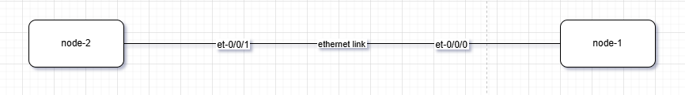
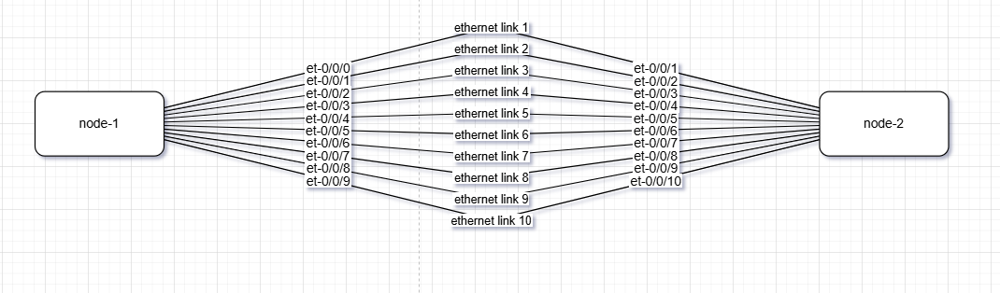

# Lazy Diagramming with N2G

### Why

I picked up `N2G` early on in my network engineering job to avoid falling into the rabbit hole of creating _✨aesthetic✨_ network diagrams.  

By automating the basics, I am much more willing to create a diagram, blow it up, and recreate it as the lab evolves. 

### How

It is probably easier to consolidate CSVs for links and nodes initially

### Results

Basic P2P diagram example using `kk` algorithm:



But with more dense connections, some fine-tuning would have to be done on Drawio, such as using the `parallel` layout...



### Future Improvements

- Translating live device configurations (via NAPALM or Netmiko) or `show lldp neighbors` outputs directly into these diagrams.
- Utilising this for high-density patch panels and network taps where manual mapping is prone to human error.

### Script

```py
from N2G import drawio_diagram
import csv

# Initialize the Draw.io module
diagram = drawio_diagram()

# Helper funtion to process csv
def load_csv(filename):
    with open(filename, mode='r', encoding='utf-8-sig') as f:
        # list comprehension to strip whitespace from every value
        return [{k: v.strip() for k, v in row.items()} for row in csv.DictReader(f)]

# network_data = {
#     "nodes": load_csv('1-nodes.csv'),
#     "links": load_csv('1-links.csv')
# }

network_data = {
    "nodes": load_csv('2-nodes.csv'),
    "links": load_csv('2-links.csv')
}

# network_data = {
#     "nodes": load_csv('3-nodes.csv'),
#     "links": load_csv('3-links.csv')
# }


diagram.from_dict(network_data, diagram_name="Page-1")
diagram.layout(algo="fr")
diagram.dump_file(filename="Sample_graph_1.drawio", folder="./Output/")
```
