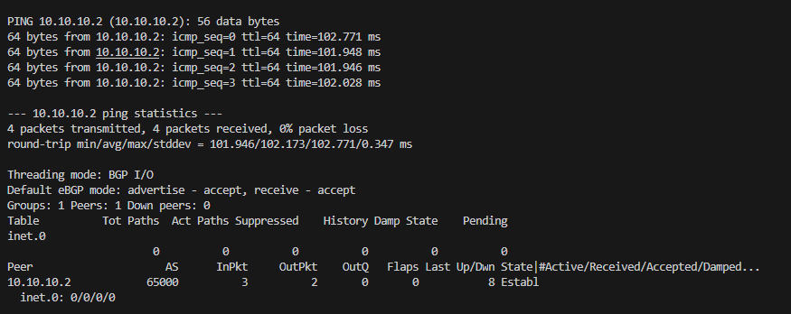

# The Swiss Army VM: Using Python Netmiko and Linux frr in Juniper vLABs

### Why
When testing customer setups, I use Juniper vLABs because it is way faster than dealing with EVE-NG on my laptop.  
While the pre-built topologies give a reasonable base to work with, the pre-loaded configurations still need to be overridden for more specific ones.  

A lesser known 'hack' is that the superuser passwords for the virtual instances were all `Juniper!1`.  
Because of this, I wanted to see if I could treat the provided Linux VMs like a multi-tool to make the labs more useful.  

### What I Did
I wrote a Python script using `netmiko` to speed up the configuration of both the Linux VMs and virtual Juniper devices.  
In this scenario, the script sets up an iBGP peering session between vQFX switch and a Linux VM.


Most of the 'work' had to be done on the Linux VM, namely:
- Installing `frr` to provide routing capabilities
- Using `netplan` to update the IP addressing

Also, it was a little challenging to automate `frr` configuration, as this was essentially a "shell within a shell" scenario for `netmiko`.  
`frr` uses the Cisco-like `vtysh`, which adds another layer on top of the Linux shell.  
Since `netmiko` standard `send_config_set()` expects a standard terminal, I used a line-by-line `send_command()` approach with specific `expect_string` triggers to navigate the sub-shell transitions.



### Where Can I Go With This?
I have taken this approach to test and verify other common services involving NTP and SNMP for actual customer projects.  
Overall, I found it very exciting to expand the use cases of Juniper vLABs and this exercise is a great primer for network automation.

### Script

```py
from netmiko import ConnectHandler

# Connection parameters for Linux VM
linux_vm = {
    'device_type': 'linux',
    'host': '66.129.235.202',
    'username': 'root',
    'password': 'Juniper!1',
    'port': 36008
}

# Connection parameters for vQFX
juniper_qfx = {
    'device_type': 'juniper_junos',
    'host': '66.129.235.202',
    'username': 'jcluser',
    'password': 'Juniper!1',
    'port': 36034
}

def update_linux_ip_address(ssh):
    
    # Update Linux VM IP
    new_netplan = """network:
        version: 2
        renderer: networkd
        ethernets:
            eth0:
            dhcp4: true
            dhcp-identifier: mac
            eth2:
            addresses:
                - 10.10.10.2/24
        """
    update_netplan_yaml = f"tee /etc/netplan/01-network-manager-all.yaml <<EOF\n{new_netplan}\nEOF"
    
    output = ssh.send_command(update_netplan_yaml, cmd_verify=False)
    print(output)

    output = ssh.send_command("netplan generate", read_timeout=300)
    print(output)

    output += ssh.send_command("netplan apply", read_timeout=300)
    print(output)

    output += ssh.send_command("ip addr show", read_timeout=300)
    print(output)

def install_linux_bgp(ssh):
    
    # Install frr service on Linux VM

    output = ssh.send_command("apt update", read_timeout=300)
    print(output)

    output = ssh.send_command("apt install frr -y", read_timeout=300)
    print(output)

    output = ssh.send_command("sed -i 's/bgpd=no/bgpd=yes/g' /etc/frr/daemons", read_timeout=300)
    print(output)
    
    output = ssh.send_command("systemctl restart frr", read_timeout=300)
    print(output)

def configure_linux_bgp(ssh):

    # Configure Linux VM as BGP peer

    bgp_config = [
        'configure terminal',
        'router bgp 65000',
        'bgp router-id 10.10.10.2',
        'neighbor 10.10.10.3 remote-as 65000',
        'exit',
        'write memory',
        'exit'
    ]

    output = ssh.send_command("vtysh", expect_string=r".*#")
    print(output)

    output = ssh.send_command("\n".join(bgp_config), expect_string=r".*#", cmd_verify=False)
    print(output)

def configure_juniper_bgp(ssh):
    
    vlan_config = [
        'delete vlans VLAN200',
        'set vlans VLAN200 vlan-id 200'
    ]

    interface_config = [
        'delete interfaces xe-0/0/1',
        'set interfaces xe-0/0/1 unit 0 family ethernet-switching interface-mode access vlan members VLAN200'
    ]

    irb_config = [
        'delete interfaces irb.200',
        'set interfaces irb.200 family inet address 10.10.10.3/24'
    ]

    irb_vlan_config = [
        'set vlans VLAN200 l3-interface irb.200'
    ]

    base_bgp_config = [
        'delete routing-options router-id',
        'set routing-options router-id 10.10.10.3',
        'set routing-options autonomous-system 65000'
    ]

    bgp_peering_config = [
        'delete protocols bgp',
        'set protocols bgp group TEST type internal neighbor 10.10.10.2 local-address 10.10.10.3'
    ]

    # configure VLAN
    output = ssh.send_config_set(vlan_config, exit_config_mode=False, cmd_verify=False)
    output += ssh.send_command("commit check")
    output += ssh.commit()
    print(output)

    # configure Interface
    output = ssh.send_config_set(interface_config, exit_config_mode=False, cmd_verify=False)
    output += ssh.send_command("commit check")
    output += ssh.commit()
    print(output)

    # configure irb
    output = ssh.send_config_set(irb_config, exit_config_mode=False, cmd_verify=False)
    output += ssh.send_command("commit check")
    output += ssh.commit()
    print(output)

    # configure irb association with vlan
    output = ssh.send_config_set(irb_vlan_config, exit_config_mode=False, cmd_verify=False)
    output += ssh.send_command("commit check")
    output += ssh.commit()
    print(output)

    # configure bgp
    output = ssh.send_config_set(base_bgp_config, exit_config_mode=False, cmd_verify=False)
    output += ssh.send_command("commit check")
    output += ssh.commit()
    print(output)

    # configure bgp peering
    output = ssh.send_config_set(bgp_peering_config, exit_config_mode=False, cmd_verify=False)
    output += ssh.send_command("commit check")
    output += ssh.commit()
    print(output)

    # exit config mode
    output += ssh.exit_config_mode()
    print(output)

def verify_juniper(ssh):
    
    # Check connectivity to Linux VM
    output = ssh.send_command("ping 10.10.10.2 count 4")
    print(output)

    # CHeck BGP
    output = ssh.send_command("show bgp summary")
    print(output)


with ConnectHandler(**linux_vm) as ssh:
    update_linux_ip_address(ssh)
    install_linux_bgp(ssh)
    configure_linux_bgp(ssh)

with ConnectHandler(**juniper_qfx) as ssh:
    # configure_juniper_bgp(ssh)
    verify_juniper(ssh)from netmiko import ConnectHandler

# Connection parameters for Linux VM
linux_vm = {
    'device_type': 'linux',
    'host': '66.129.235.202',
    'username': 'root',
    'password': 'Juniper!1',
    'port': 36008
}

# Connection parameters for vQFX
juniper_qfx = {
    'device_type': 'juniper_junos',
    'host': '66.129.235.202',
    'username': 'jcluser',
    'password': 'Juniper!1',
    'port': 36034
}

def update_linux_ip_address(ssh):
    
    # Update Linux VM IP
    new_netplan = """network:
        version: 2
        renderer: networkd
        ethernets:
            eth0:
            dhcp4: true
            dhcp-identifier: mac
            eth2:
            addresses:
                - 10.10.10.2/24
        """
    update_netplan_yaml = f"tee /etc/netplan/01-network-manager-all.yaml <<EOF\n{new_netplan}\nEOF"
    
    output = ssh.send_command(update_netplan_yaml, cmd_verify=False)
    print(output)

    output = ssh.send_command("netplan generate", read_timeout=300)
    print(output)

    output += ssh.send_command("netplan apply", read_timeout=300)
    print(output)

    output += ssh.send_command("ip addr show", read_timeout=300)
    print(output)

def install_linux_bgp(ssh):
    
    # Install frr service on Linux VM

    output = ssh.send_command("apt update", read_timeout=300)
    print(output)

    output = ssh.send_command("apt install frr -y", read_timeout=300)
    print(output)

    output = ssh.send_command("sed -i 's/bgpd=no/bgpd=yes/g' /etc/frr/daemons", read_timeout=300)
    print(output)
    
    output = ssh.send_command("systemctl restart frr", read_timeout=300)
    print(output)

def configure_linux_bgp(ssh):

    # Configure Linux VM as BGP peer

    bgp_config = [
        'configure terminal',
        'router bgp 65000',
        'bgp router-id 10.10.10.2',
        'neighbor 10.10.10.3 remote-as 65000',
        'exit',
        'write memory',
        'exit'
    ]

    output = ssh.send_command("vtysh", expect_string=r".*#")
    print(output)

    output = ssh.send_command("\n".join(bgp_config), expect_string=r".*#", cmd_verify=False)
    print(output)

def configure_juniper_bgp(ssh):
    
    vlan_config = [
        'delete vlans VLAN200',
        'set vlans VLAN200 vlan-id 200'
    ]

    interface_config = [
        'delete interfaces xe-0/0/1',
        'set interfaces xe-0/0/1 unit 0 family ethernet-switching interface-mode access vlan members VLAN200'
    ]

    irb_config = [
        'delete interfaces irb.200',
        'set interfaces irb.200 family inet address 10.10.10.3/24'
    ]

    irb_vlan_config = [
        'set vlans VLAN200 l3-interface irb.200'
    ]

    base_bgp_config = [
        'delete routing-options router-id',
        'set routing-options router-id 10.10.10.3',
        'set routing-options autonomous-system 65000'
    ]

    bgp_peering_config = [
        'delete protocols bgp',
        'set protocols bgp group TEST type internal neighbor 10.10.10.2 local-address 10.10.10.3'
    ]

    # configure VLAN
    output = ssh.send_config_set(vlan_config, exit_config_mode=False, cmd_verify=False)
    output += ssh.send_command("commit check")
    output += ssh.commit()
    print(output)

    # configure Interface
    output = ssh.send_config_set(interface_config, exit_config_mode=False, cmd_verify=False)
    output += ssh.send_command("commit check")
    output += ssh.commit()
    print(output)

    # configure irb
    output = ssh.send_config_set(irb_config, exit_config_mode=False, cmd_verify=False)
    output += ssh.send_command("commit check")
    output += ssh.commit()
    print(output)

    # configure irb association with vlan
    output = ssh.send_config_set(irb_vlan_config, exit_config_mode=False, cmd_verify=False)
    output += ssh.send_command("commit check")
    output += ssh.commit()
    print(output)

    # configure bgp
    output = ssh.send_config_set(base_bgp_config, exit_config_mode=False, cmd_verify=False)
    output += ssh.send_command("commit check")
    output += ssh.commit()
    print(output)

    # configure bgp peering
    output = ssh.send_config_set(bgp_peering_config, exit_config_mode=False, cmd_verify=False)
    output += ssh.send_command("commit check")
    output += ssh.commit()
    print(output)

    # exit config mode
    output += ssh.exit_config_mode()
    print(output)

def verify_juniper(ssh):
    
    # Check connectivity to Linux VM
    output = ssh.send_command("ping 10.10.10.2 count 4")
    print(output)

    # CHeck BGP
    output = ssh.send_command("show bgp summary")
    print(output)


with ConnectHandler(**linux_vm) as ssh:
    update_linux_ip_address(ssh)
    install_linux_bgp(ssh)
    configure_linux_bgp(ssh)

with ConnectHandler(**juniper_qfx) as ssh:
    # configure_juniper_bgp(ssh)
    verify_juniper(ssh)
```
